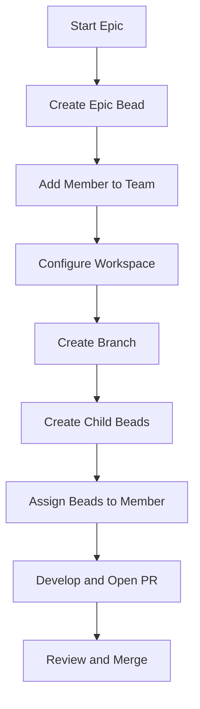

# Adding a New Workspace Member When Starting an Epic

## Overview
When an epic is created, it often requires additional contributors to implement the work. This document explains the standard process for onboarding a new workspace member to ensure consistency across PRs.

## When to Add a Workspace Member
- At the start of an epic, if the scope requires additional expertise
- When a new contributor is assigned to the project
- When a team is expanded to support a new area

## Step-by-Step Process

1. **Create the Epic Bead**
   - Use `bd create` to file an epic bead with type `epic`.
   - Reference the associated plan document and acceptance criteria.
   - Example:
     ```bash
     bd create \
       --title="Implement workspace member onboarding workflow" \
       --description="Plan: docs/adding-workspace-members.md" \
       --acceptance="Epic bead created and linked to the GitHub issue." \
       --type=epic --priority=2
     ```

2. **Add the Member to the Repository**
   - **GitHub Team**: Add the member to the appropriate team (e.g., `team-frontend`, `team-backend`).
   - **Access**: Ensure they have SSH keys added to their GitHub account and can push to the repository.
   - **Documentation**: Update the `MEMBERS.md` (or similar) file to list the new member, if applicable.

3. **Configure the Workspace**
   - Provide instructions for setting up the development environment:
     - Install dependencies (e.g., `make test-deps`)
     - Clone the repository
     - Set up environment variables (e.g., `ROGERS_<KEY>`)
   - Example instructions can be found in `docs/getting-started.md`.

4. **Create a Dedicated Branch**
   - Create a branch for the epic work, named consistently (e.g., `epic/<epic-id>-<short-title>`).
   - Push the branch and set the upstream tracking.

5. **Set Up Issue Tracking for the Member**
   - Create child beads for each sub-task.
   - Assign child beads to the member by adding their username as the bead author or by adding a label (e.g., `assigned-to:<username>`).
   - Ensure each child bead includes an acceptance criteria section.

6. **Communicate the Setup**
   - Post a comment on the epic bead with the member's username and onboarding details.
   - Provide links to relevant documentation and the branch name.

7. **Follow the PR Pattern**
   - When opening a PR, reference the epic bead ID in the PR title and description.
   - Ensure the PR includes a checklist linking to the acceptance criteria.
   - Request reviews from the appropriate team leads.

## Example Workflow


## Checklist for Authors
- [ ] The epic bead is properly documented with a `Plan:` reference.
- [ ] The new member has been added to the correct GitHub team.
- [ ] Workspace setup instructions are up to date.
- [ ] Child beads are created and assigned.
- [ ] PR template includes references to the epic bead.

## Related Documentation
- `docs/getting-started.md` — Development environment setup
- `plans/feature-bug-plan.md` — Bead creation and acceptance criteria
- `plans/triage-workflow-plan.md` — Triage and epic detection process