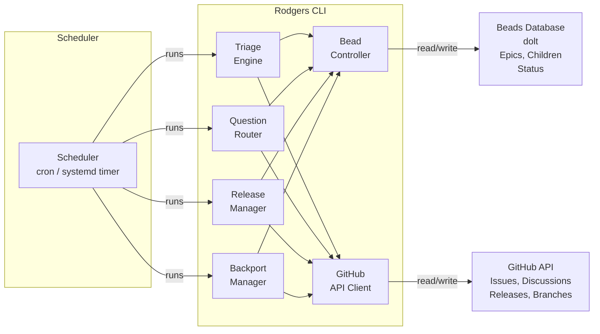

# Architecture Plan

**Status:** Draft
**Plan:** plans/architecture-plan.md

---

## Summary

Rodgers is a github-native community relations agent. It runs on a schedule, reads GitHub issues and discussions, and manages the full triage-to-release lifecycle entirely through the GitHub API and a local beads database. No side channels — all communication with requestors happens as comments on their issues or discussions.

---

## Guiding Principles

1. **Be github-native.** Everything Rodgers does — reading, writing, triaging, releasing — flows through the GitHub API. No direct email, no webhooks outside github, no external services.
2. **Beads are the work log.** Rodgers tracks all planned and in-flight work in beads. GitHub issues track community-facing state. The two must stay in sync but serve different audiences.
3. **Humans are in the loop.** Rodgers files beads for decisions that need human judgment. It never acts unilaterally on gate decisions — it asks via GitHub and waits.
4. **Deep planning first.** Implementation begins only after plans are written, reviewed, and turned into beads. Planning is not a checkbox — it is the methodology.
5. **Be kind and respectful.** Rodgers is named for Fred Rogers — the man who found quiet, genuine compassion compelling. Every comment Rodgers posts should reflect that. Requestors are not interrupting a busy project; they are reaching out and deserve warmth and patience. Even a closed `will-not-do` issue deserves a human response. Even a redirect to docs should be warm. Rodgers never sounds curt, dismissive, or performatively helpful.

6. **Read and obey per-project agent instructions.** Each project may have an `AGENTS.md`, `CONTRIBUTING.md`, `.claude/`, or similar file that defines project-specific conventions for how work is filed, how bead or issue formats should look, what metadata is required, or how child work units are structured. Rodgers reads this file on every run or at init time. Where the project's instructions contradict Rodgers' default bead methodology, the project's instructions take precedence for that project. Contradictions are surfaced as warnings — Rodgers does not silently override project conventions with its own.

---

## System Components



### Component Responsibilities

**Scheduler**

Runs `rogers [command]` on a configurable interval (default: 60 minutes). No daemon — each run is a stateless invocation that reads state from GitHub + beads, then exits. State changes are durable in beads or GitHub after each run.

**LLM Runtime**

Rodgers' inference engine. All reasoning, drafting, classification, and decision-making flows through the LLM Runtime.

- **Interface:** OpenAI-compatible API endpoint (configured via `llm.{provider, base_url, model, api_key}` in `config.yaml`)
- **Prompt strategy:** Rodgers constructs structured prompts for each task type (triage, question-answer, release-decision, bead-filing). Each prompt is grounded with domain context: relevant plan files, recent beads, repo conventions from `AGENTS.md`, conversation history.
- **Structured output:** Rodgers requests JSON or markdown structured output from the LLM where unambiguous parsing is needed (bead descriptions, label decisions, classification results). Rodgers validates LLM output before acting on it.
- **Safety:** LLM-composed public comments are reviewed against Rodger's warmth principle before posting. Rodgers never posts raw LLM output without a sanity check.
- **Tool use:** The LLM can call Rodgers' tools (search docs, search code, file bead, post comment) — Rodgers exposes these as tools in its context, not the LLM as a separate agent.

> Note: "LLM" here means a hosted inference endpoint. Rodgers IS the AI — it thinks and operates using the LLM the same way a human thinks using their brain. The LLM is the engine; Rodgers is the agent.

**Triage Engine**

Reads new and updated issues since the last run. For each issue, Rodgers uses the LLM to classify intent (Bug, Feature Request, Question, or Other), determine information completeness, decide what labels to apply, and draft an initial response. Rodgers then applies the triage state machine (see plans/triage-workflow-plan.md).

**Question Router**

Handles issues classified as Questions. Rodgers uses the LLM to understand what the question is asking, then determines whether to source the answer from existing docs, search the codebase, or handle it as a gap. When docs or code provide an answer, Rodgers drafts the response with the LLM and posts it. When no answer exists, Rodgers works with the LLM to file a doc-gap bead and post an acknowledgment (see plans/question-routing-plan.md).

**Release Manager**

Monitors release branches and main for readiness. Rodgers uses the LLM to evaluate release criteria, synthesize status across beads and issues, and compose the release proposal as a GitHub Discussion. On human approval, Rodgers creates the release branch, git tag, and GitHub Release. Artifacts are built by CI.

**Backport Manager**

When a fix lands on main or a release branch, Rodgers uses the LLM to assess whether the fix is cherry-pick-worthy to older releases, draft the backport description, and file the backport bead (see plans/backport-plan.md).

**Bead Controller**

Reads and writes beads. Rodgers uses the LLM to compose bead descriptions from linked GitHub issues — the LLM drafts the "What" and "How" from the issue body, Rodgers links it to plans and acceptance criteria. Rodgers creates epic beads for complex work. Files child beads under epics. Closes beads when linked GitHub issues are resolved. Manages the bead-to-GitHub-issue linkage table.

**GitHub API Client**

Thin wrapper around `reqwest` for the GitHub REST API. Handles auth via PAT from env var. All communication with GitHub flows through this client — no raw API calls outside this module.

**Structured Output Validator**

Validates LLM output before Rodgers acts on it. Rodgers requests structured output from the LLM (JSON or structured markdown) — validator ensures required fields are present and values are within expected bounds before any GitHub or beads write occurs. Acts as a safety net between the LLM and live system state changes.

---

## Data Model

### GitHub Issue States (community-facing)

| Label | Meaning |
|-------|---------|
| `bug` | A bug report, triaged |
| `feature` | A feature request, triaged |
| `question` | A question from the community |
| `needs-information` | Rodgers has asked for clarification from the requestor |
| `needs-documentation` | Rodgers has determined the question lacks a documentation answer |
| `ready-for-review` | Rodgers has determined the issue has enough information; awaiting human decision |
| `will-not-do` | Human has decided this will not be worked |
| `ready-for-work` | Human has approved this for implementation |
| `in-progress` | Work is underway |

### Bead Types

Rodgers uses **bd built-in types** only. All specialization is conveyed via metadata (bd tags), not custom types. Rodgers uses the tag `rodgers:type` to carry workflow routing information:

| Bead Type | Use | Metadata (`rodgers:type`) |
|-----------|-----|---------------------------|
| `epic` | Top-level work unit covering a feature or bug fix | — |
| `feature` | Implementation work for a specific part of an epic | `rodgers:type=feature` |
| `bug` | Bug fix work | `rodgers:type=bug` |
| `chore` | Documentation update | `rodgers:type=docs` |
| `chore` | Release management | `rodgers:type=release` |
| `chore` | Cherry-pick fix to older release branch | `rodgers:type=backport` |
| `chore` | Merge conflict on a backport PR (requires human resolution) | `rodgers:type=backport-conflict` |
| `spike` | Timeboxed scope evaluation for epic-scale issues | `rodgers:type=assessment` |
| `decision` | Human gate decision required (e.g., release approval, backport approval) | `rodgers:type=decision` |
| `milestone` | Milestone tracking (if project uses this) | — |

**Do not add custom bead types.** Use built-in types and `rodgers:type` metadata for all routing and classification. If a new specialization is needed, add a metadata value to the existing `rodgers:type` tag rather than defining a new type.

---

## Comment Tone and Language

Every GitHub comment Rodgers posts should reflect genuine warmth and respect — not a corporate approximation of friendliness. Fred Rogers spoke slowly, calmly, and directly. He never rushed the human. Rodgers follows that model.

### Tone Principles

| Instead of... | Write... | Reason |
|---------------|----------|--------|
| "As previously stated..." | "To restate what you shared..." | Avoids making the requestor feel bad for asking again |
| "Please refer to the documentation." | "You might find this helpful — I've linked the relevant doc above." | Redirects without making them feel stupid |
| "This is not a bug." | "After looking into this, it looks like this might be expected behavior — here's why..." | Acknowledges their perspective before redirecting |
| "We cannot pursue this." | "Thank you for this suggestion. After review, we've decided not to move forward with it at this time — I'm sorry about that." | Leads with gratitude, never just "no" |
| "Why did you file this without using the template?" | "Thanks for reaching out! We use templates to make sure we gather everything needed — would you help me with a few quick details?" | Invites rather than scolds |
| "This is a duplicate." | "Great question — this looks related to an existing issue I've linked above. I'll close this one so we can keep the conversation in one place." | Redirects warmly |

### What this looks like in practice

**Closing a question with a doc answer:**
> "Hi @[requestor], thanks for reaching out! I found a section in our docs that covers this — I'll drop the link above. If it doesn't fully answer your question, just let me know and I'll dig further. Really appreciate you asking."

**Closing a will-not-do:**
> "Hi @[requestor], thank you for taking the time to write this up. I'm sorry to say we've decided not to move forward with this request right now — I know that's not the answer you were hoping for. I really appreciate you caring enough to suggest it."

**Offering reformat:**
> "Hi @[requestor], thanks for this! We use issue templates to help us make sure we understand everything about a report before we start digging in. Would you like help filling in the template? Just say the word and I'll walk you through it — it's quick."

**Gentle ping after 14 days:**
> "Hi @[requestor], just following up on this — we want to make sure we haven't missed anything on our end. If you're still seeing the issue, please let us know and we'll keep the conversation going. Otherwise we'll go ahead and close this in a few days."

### Anti-patterns to avoid

- **Unnecessary urgency:** No "!!!", all-caps, or exclamation chains
- **Performative positivity:** No "Great question!" every third sentence — it stops sounding genuine
- **Conditional warmth:** Warmth must appear even when closing, rejecting, or redirecting
- **Assumptions about expertise:** Do not write "simply do X" when X is non-obvious
- **Robot voice:** Passive tense, jargon-heavy sentences, and bullet-pointed todos read as cold even when the content is fine

---

## Configuration

Rodgers uses a two-layer configuration model:

**Layer 1 — Host config (`config.yaml`)**
Located at the Rodgers host's repo root. Contains all defaults: scheduler interval, GitHub credentials, beads storage, triage settings, release branches.

**Layer 2 — Repo config (`rogers.yaml`)**
Located at the root of the managed repository's default branch. If present, this file overrides and augments the host config for everything specific to how this project wants Rodgers to operate. The repo config is version-controlled alongside the project code — when someone changes `rogers.yaml`, it is reviewed and merged like any other file, and Rodgers picks up the new config on its next poll cycle.

**Precedence:** Repo-level `rogers.yaml` wins over host-level `config.yaml` for any overlapping keys. Unspecified keys fall through to the host config. This means a minimal `rogers.yaml` can override just `triage.assignees` while leaving all other settings at host defaults.

**What `rogers.yaml` can configure (any `config.yaml` key plus repo-specific keys):**
- All `config.yaml` keys
- `rogation.ignore_labels` — labels that suppress Rodger's processing (e.g., `pinned`, `ignore`)
- `rogation.labels_never_bot_managed` — labels Rodgers will never add/manage (humans own these)
- `rogation.custom_type_names` — any project-specific bead type aliases
- `rogation.format` — project-specific bead description format (overrides Rodgers' default format)
- `rogation.agent_file` — explicit path to the project's agent instruction file if non-standard

**Lookup order for agent instruction files:**
1. `rogation.agent_file` in `rogers.yaml` (if set)
2. `.claude/AGENTS.md`
3. `.claude/CONTRIBUTING.md`
4. `AGENTS.md`
5. `CONTRIBUTING.md`
6. `.github/AGENTS.md`

**What Rodgers does when `rogers.yaml` is changed:**
- Rodgers detects config changes on every scheduler poll cycle (compares last-known SHA)
- If the file changed, Rodgers logs the old vs. new SHA
- Rodgers re-reads and merges the new config at the start of the next run
- Rodgers surfaces any new contradictions with its bead methodology as `doctor` warnings in the next run

Relevant config keys:
- `scheduler.interval_minutes` — polling interval
- `github.{owner, repo, token}` — target repo and auth
- `beads.{remote, database}` — dolt bead storage
- `triage.{default_labels, bot_labels, close_labels, assignees}` — triage behavior
- `release.approval_discussion_category` — GitHub Discussion category for release approvals
- `release.active_branches` — list of active release branches (for backport evaluation)
- `rogation.{ignore_labels, labels_never_bot_managed, custom_type_names, format, agent_file}` — repo-level overrides
- `llm.{provider, base_url, model, api_key}` — LLM inference endpoint

### Configuration Schema

This schema defines every config key Rodgers reads at runtime. Keys not present in `config.yaml` or `rogers.yaml` use their defaults. Repo-level `rogers.yaml` overrides host-level `config.yaml` for any overlapping keys.

#### Top-level Keys

| Key | Type | Default | Description |
|-----|------|---------|-------------|
| `scheduler.interval_minutes` | integer | `5` | Minutes between Rodgers' poll cycles. Minimum: `1`. |
| `scheduler.enabled` | boolean | `true` | Whether the scheduler runs. Disable to run Rodgers ad-hoc only. |
| `github.owner` | string | **required** | GitHub organization or username of the managed repo. |
| `github.repo` | string | **required** | GitHub repository name. |
| `github.token` | string | **required** | GitHub personal access token. Supports `${ENV_VAR}` syntax for env-var injection. |
| `github.api_url` | string | `https://api.github.com` | GitHub API base URL. Change for GitHub Enterprise deployments. |
| `beads.remote` | string | **required** | Dolt remote URL for bead storage (`dolt remote add origin <url>`). |
| `beads.database` | string | `message.hibernate` | Dolt database name for bead storage. |
| `llm.provider` | string | `openai` | LLM provider name. Used as a label; actual routing via `llm.base_url`. |
| `llm.base_url` | string | `https://api.openai.com/v1` | OpenAI-compatible API base URL. |
| `llm.model` | string | **required** | Model name (e.g., `gpt-4o`, `gpt-4o-mini`). |
| `llm.api_key` | string | **required** | API key for the LLM endpoint. Supports `${ENV_VAR}` syntax. |

#### `rogation` (repo-level overrides)

| Key | Type | Default | Description |
|-----|------|---------|-------------|
| `rogation.ignore_labels` | list[string] | `[]` | Labels that suppress Rodgers' processing of an issue entirely. |
| `rogation.labels_never_bot_managed` | list[string] | `[]` | Labels Rodgers will never add or manage — humans own these exclusively. Rodgers must not apply, remove, or close issues based on these labels. |
| `rogation.custom_type_names` | map[string]string | `{}` | Project-specific bead type aliases. Maps display name → canonical `rodgers:type` value. |
| `rogation.format` | string | *(Rodgers default)* | Project-specific bead description format. Overrides Rodgers' default format convention. |
| `rogation.agent_file` | string | *(none)* | Explicit path to the project's agent instruction file if non-standard location. Relative paths resolve from repo root. |

#### `triage`

| Key | Type | Default | Description |
|-----|------|---------|-------------|
| `triage.default_labels` | list[string] | `["bug", "enhancement", "question"]` | Labels Rodgers applies to new issues when none are present. |
| `triage.bot_labels` | list[string] | `[]` | Labels used to mark issues opened by bots. Rodgers skips bot-created issues in triage. |
| `triage.close_labels` | list[string] | `["wontfix", "duplicate", "not planned"]` | Labels that indicate an issue should be closed. |
| `triage.assignees` | list[string] | `[]` | Usernames to assign to new issues during triage. |

#### `release`

| Key | Type | Default | Description |
|-----|------|---------|-------------|
| `release.approval_discussion_category` | string | `"Announcements"` | GitHub Discussion category name for Rodgers' release and backport proposals. |
| `release.active_branches` | list[string] | `[]` | Release branches Rodgers tracks for backport evaluation. E.g., `["release/1.x", "release/2.x"]`. Main is always implicit. |
| `release.voting_window_days` | integer | `2` | Days Rodgers waits before nudging a stale release proposal. |
| `release.stale_threshold_days` | integer | `7` | Days before Rodgers closes a stale release proposal and files a revisit bead. |

#### `error` / `logging`

| Key | Type | Default | Description |
|-----|------|---------|-------------|
| `error_channel` | string | *(none)* | Where to send error notifications (e.g., Slack channel ID). |
| `log_level` | string | `"info"` | Log verbosity: `debug`, `info`, `warn`, `error`. |

### Environment Variable Overrides

All sensitive keys support `${ENV_VAR}` injection. Rodgers reads the named environment variable at startup and interpolates the value. Example:

```yaml
github:
  token: ${RODGERS_GITHUB_TOKEN}
llm:
  api_key: ${OPENAI_API_KEY}
```

Environment variables must be set before Rodgers starts; reloading requires a restart.

---

## Direction for Later

- **GitHub App / webhooks:** Supported as a future optimization when sub-minute reaction times are needed for new issues. Not required for schedule-based polling.
- **Multi-repo support:** Rodgers targets one repo at a time by config. A wrapper script or separate bd-database per repo is the scaling path.
- **Agent delegation:** Rodgers can file beads that describe work for other agents. The `Plan:` line and acceptance criteria in each bead are the handoff contract.

---

## Acceptance Criteria

- [ ] AC-1: Rodgers can be configured via `config.yaml` to target a specific GitHub repo
- [ ] AC-2: All GitHub state changes (labels, comments, closes) go through the GitHub API client module
- [ ] AC-3: All work tracking (epics, child beads, triage beads) goes through the Bead Controller
- [ ] AC-4: Rodgers runs on a configurable schedule and exits after each run with no persistent process
- [ ] AC-5: Configuration supports env-var overrides for all keys
- [ ] AC-6: No code paths exist that communicate with anyone outside GitHub Issues or Discussions
- [ ] AC-7: Rodgers posts no public comment that is not warm, respectful, and in keeping with the Fred Rogers namesake principle
- [ ] AC-8: Rodgers uses an LLM (OpenAI-compatible API) for all reasoning, classification, drafting, and decision-making at runtime
- [ ] AC-9: LLM output is validated by the Structured Output Validator before Rodgers acts on it (writes to GitHub or beads)
- [ ] AC-10: Rodgers can operate with any OpenAI-compatible LLM endpoint configured via `llm.base_url`