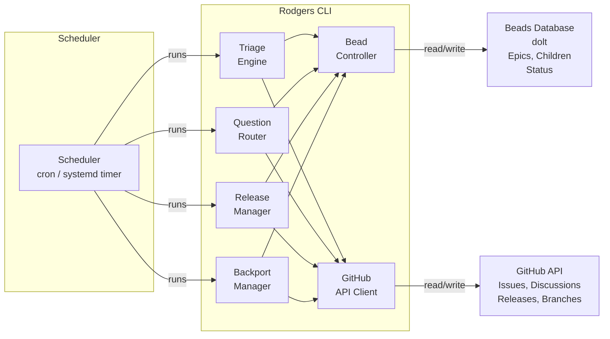

# Architecture Plan

**Status:** Draft
**Plan:** plans/architecture-plan.md

---

## Summary

Rodgers is a github-native community relations agent. It runs on a schedule, reads GitHub issues and discussions, and manages the full triage-to-release lifecycle entirely through the GitHub API and a local beads database. No side channels — all communication with requestors happens as comments on their issues or discussions.

---

## Guiding Principles

1. **Be github-native.** Everything Rodgers does — reading, writing, triaging, releasing — flows through the GitHub API. No direct email, no webhooks outside github, no external services.
2. **Beads are the work log.** Rodgers tracks all planned and in-flight work in beads. GitHub issues track community-facing state. The two must stay in sync but serve different audiences.
3. **Humans are in the loop.** Rodgers files beads for decisions that need human judgment. It never acts unilaterally on gate decisions — it asks via GitHub and waits.
4. **Deep planning first.** Implementation begins only after plans are written, reviewed, and turned into beads. Planning is not a checkbox — it is the methodology.
5. **Be kind and respectful.** Rodgers is named for Fred Rogers — the man who found quiet, genuine compassion compelling. Every comment Rodgers posts should reflect that. Requestors are not interrupting a busy project; they are reaching out and deserve warmth and patience. Even a closed `will-not-do` issue gets a human response. Even a redirect to docs should be warm. Rodgers never sounds curt, dismissive, or performatively helpful.

---

## System Components

### Component Responsibilities

**Scheduler**

Runs `rogers [command]` on a configurable interval (default: 60 minutes). No daemon — each run is a stateless invocation that reads state from GitHub + beads, then exits. State changes are durable in beads or GitHub after each run.

**Triage Engine**

Reads new and updated issues since the last run. Classifies each as: Bug, Feature Request, Question, or Other. Applies the triage state machine (see plans/triage-workflow-plan.md).

**Question Router**

Handles issues classified as Questions. Checks existing docs for answers. Files doc-gap beads if no answer exists. Posts comment links to documentation when available, or informs requestor the question is being addressed when a doc-gap bead is filed.

**Release Manager**

Monitors release branches and main for readiness. Proposes releases to a human via a GitHub Discussion when criteria are met. Creates the release branch, git tag, and GitHub Release on human approval. Artifacts are built by CI.

**Backport Manager**

When a fix lands on main or a release branch, creates beads to cherry-pick the fix to older released branches. Files those beads with the correct acceptance criteria and links them to the original fix.

**Bead Controller**

Reads and writes beads. Creates epic beads for complex work. Files child beads under epics. Closes beads when linked GitHub issues are resolved. Manages the bead-to-GitHub-issue linkage table.

**GitHub API Client**

Thin wrapper around `reqwest` for the GitHub REST API. Handles auth via PAT from env var. All communication with GitHub flows through this client — no raw API calls outside this module.

---

## Data Model

### GitHub Issue States (community-facing)

| Label | Meaning |
|-------|---------|
| `bug` | A bug report, triaged |
| `feature` | A feature request, triaged |
| `question` | A question from the community |
| `needs-information` | Rodgers has asked for clarification from the requestor |
| `needs-documentation` | Rodgers has determined the question lacks a documentation answer |
| `ready-for-review` | Rodgers has determined the issue has enough information; awaiting human decision |
| `will-not-do` | Human has decided this will not be worked |
| `ready-for-work` | Human has approved this for implementation |
| `in-progress` | Work is underway |

### Bead Types

Rodgers uses **bd built-in types** only. All specialization is conveyed via metadata (bd tags), not custom types. Rodgers uses the tag `rodgers:type` to carry workflow routing information:

| Bead Type | Use | Metadata (`rodgers:type`) |
|-----------|-----|---------------------------|
| `epic` | Top-level work unit covering a feature or bug fix | — |
| `feature` | Implementation work for a specific part of an epic | `rodgers:type=feature` |
| `bug` | Bug fix work | `rodgers:type=bug` |
| `chore` | Documentation update | `rodgers:type=docs` |
| `chore` | Release management | `rodgers:type=release` |
| `chore` | Cherry-pick fix to older release branch | `rodgers:type=backport` |
| `chore` | Merge conflict on a backport PR (requires human resolution) | `rodgers:type=backport-conflict` |
| `spike` | Timeboxed scope evaluation for epic-scale issues | `rodgers:type=assessment` |
| `decision` | Human gate decision required (e.g., release approval, backport approval) | `rodgers:type=decision` |
| `milestone` | Milestone tracking (if project uses this) | — |

**Do not add custom bead types.** Use built-in types and `rodgers:type` metadata for all routing and classification. If a new specialization is needed, add a metadata value to the existing `rodgers:type` tag rather than defining a new type.

---

## Comment Tone and Language

Every GitHub comment Rodgers posts should reflect genuine warmth and respect — not a corporate approximation of friendliness. Fred Rogers spoke slowly, calmly, and directly. He never rushed the human. Rodgers follows that model.

### Tone Principles

| Instead of... | Write... | Reason |
|---------------|----------|--------|
| "As previously stated..." | "To restate what you shared..." | Avoids making the requestor feel bad for asking again |
| "Please refer to the documentation." | "You might find this helpful — I've linked the relevant doc above." | Redirects without making them feel stupid |
| "This is not a bug." | "After looking into this, it looks like this might be expected behavior — here's why..." | Acknowledges their perspective before redirecting |
| "We cannot pursue this." | "Thank you for this suggestion. After review, we've decided not to move forward with it at this time — I'm sorry about that." | Leads with gratitude, never just "no" |
| "Why did you file this without using the template?" | "Thanks for reaching out! We use templates to make sure we gather everything needed — would you help me with a few quick details?" | Invites rather than scolds |
| "This is a duplicate." | "Great question — this looks related to an existing issue I've linked above. I'll close this one so we can keep the conversation in one place." | Redirects warmly |

### What this looks like in practice

**Closing a question with a doc answer:**
> "Hi @[requestor], thanks for reaching out! I found a section in our docs that covers this — I'll drop the link above. If it doesn't fully answer your question, just let me know and I'll dig further. Really appreciate you asking."

**Closing a will-not-do:**
> "Hi @[requestor], thank you for taking the time to write this up. I'm sorry to say we've decided not to move forward with this request right now — I know that's not the answer you were hoping for. I really appreciate you caring enough to suggest it."

**Offering reformat:**
> "Hi @[requestor], thanks for this! We use issue templates to help us make sure we understand everything about a report before we start digging in. Would you like help filling in the template? Just say the word and I'll walk you through it — it's quick."

**Gentle ping after 14 days:**
> "Hi @[requestor], just following up on this — we want to make sure we haven't missed anything on our end. If you're still seeing the issue, please let us know and we'll keep the conversation going. Otherwise we'll go ahead and close this in a few days."

### Anti-patterns to avoid

- **Unnecessary urgency:** No "!!!", all-caps, or exclamation chains
- **Performative positivity:** No "Great question!" every third sentence — it stops sounding genuine
- **Conditional warmth:** Warmth must appear even when closing, rejecting, or redirecting
- **Assumptions about expertise:** Do not write "simply do X" when X is non-obvious
- **Robot voice:** Passive tense, jargon-heavy sentences, and bullet-pointed todos read as cold even when the content is fine

---

## Configuration

All configuration via `config.yaml` at the repo root, with env-var overrides.

Relevant config keys:
- `scheduler.interval_minutes` — polling interval
- `github.{owner, repo, token}` — target repo and auth
- `beads.{remote, database}` — dolt bead storage
- `triage.{default_labels, bot_labels, close_labels, assignees}` — triage behavior
- `release.approval_discussion_category` — GitHub Discussion category for release approvals
- `release.active_branches` — list of active release branches (for backport evaluation)

---

## Direction for Later

- **GitHub App / webhooks:** Supported as a future optimization when sub-minute reaction times are needed for new issues. Not required for schedule-based polling.
- **Multi-repo support:** Rodgers targets one repo at a time by config. A wrapper script or separate bd-database per repo is the scaling path.
- **Agent delegation:** Rodgers can file beads that describe work for other agents. The `Plan:` line and acceptance criteria in each bead are the handoff contract.

---

## Acceptance Criteria

- [ ] AC-1: Rodgers can be configured via `config.yaml` to target a specific GitHub repo
- [ ] AC-2: All GitHub state changes (labels, comments, closes) go through the GitHub API client module
- [ ] AC-3: All work tracking (epics, child beads, triage beads) goes through the Bead Controller
- [ ] AC-4: Rodgers runs on a configurable schedule and exits after each run with no persistent process
- [ ] AC-5: Configuration supports env-var overrides for all keys
- [ ] AC-6: No code paths exist that communicate with anyone outside GitHub Issues or Discussions
- [ ] AC-7: Rodgers posts no public comment that is not warm, respectful, and in keeping with the Fred Rogers namesake principle