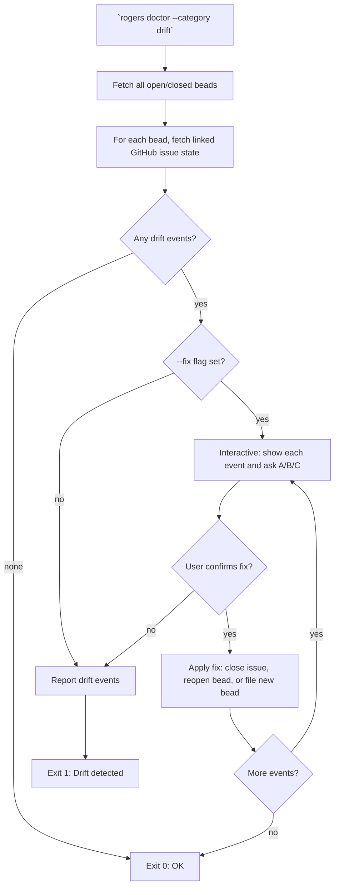

# `rogers doctor` — Configuration and Health Audit

**Status:** Draft
**Plan:** plans/doctor-plan.md

---

## Summary

`rogers doctor` audits a Rodgers installation to verify it is correctly configured, can reach its dependencies, and has not drifted from its operational invariants. It is the equivalent of a systems health check — run it whenever Rodgers seems to be missing something, before a release, or on a schedule.

Run with: `rogers doctor [--verbose] [--only CATEGORY]`

**CATEGORIES:**
- `config` — Configuration file validation
- `auth` — GitHub authentication and token permissions
- `beads` — Beads database connectivity and schema
- `plans` — Plan files referenced in config exist and are readable
- `repo` — Target repository accessibility and required labels
- `drift` — GitHub ↔ beads state consistency

---

## Config Validation

**Category:** `config`

Validates `config.yaml` against the Rodgers configuration schema. Fails fast on structural problems.

### Checks

1. **`config.yaml` exists and is valid YAML.** Rodgers exits with a descriptive error if the file is missing or malformed.
2. **All required keys are present.** Compare against the Configuration Schema in plans/architecture-plan.md. Required keys: `github.owner`, `github.repo`, `github.token`, `scheduler.interval_minutes`, `beads.remote`, `beads.database`.
3. **`scheduler.interval_minutes` is a positive integer.** Rodgers should not accept an interval of 0 or negative.
4. **`github.token` is non-empty and does not look like a placeholder.** Warn if the token value matches common placeholder strings (`YOUR_TOKEN`, `ghp_...` with obvious sample values).
5. **`release.active_branches` is a non-empty list if releases are configured.** Warn if no release branches are configured — Rodgers' backport manager depends on this.
7. **`rogation.labels_never_bot_managed` does not include Rodgers-required labels.** If `rogation.labels_never_bot_managed` contains any of `bug`, `feature`, `question`, `needs-information`, `needs-documentation`, `ready-for-review`, `will-not-do`, `ready-for-work`, `in-progress`, Rodgers warns — these labels are required for Rodgers' workflow. A project that marks `needs-documentation` as never-managed is asking Rodgers to operate with one hand tied behind its back.

### Output

```
[config] config.yaml found — valid YAML
[config] All required keys present
[config] scheduler.interval_minutes = 60 ✓
[config] WARNING: release.active_branches is empty — backport manager will not operate
[config] WARNING: triage.default_labels is empty — Rodgers may not label new issues
[config] OK
```

---

## GitHub Authentication

**Category:** `auth`

Verifies that the configured GitHub token is valid, has the correct scopes, and can access the target repository.

### Checks

1. **Token is valid.** Call `GET /user` with the token. Verify 200 response with a known username.
2. **Token has required scopes.** Rodgers needs: `repo` (full control of repositories), `read:org` (access org membership if the repo is in an org).
3. **Token can read the target repository.** Call `GET /repos/{owner}/{repo}`. Verify 200 with the expected repo name.
4. **Token can write to the target repository.** Call `GET /repos/{owner}/{repo}/permissions` or attempt a low-impact API call (e.g., list labels). Rodgers cannot operate on a repo it can only read.
5. **Token is not approaching rate limit.** If the token has less than 100 remaining requests in the current window, Rodgers warns — heavy `init` or `doctor` runs alongside normal operation could hit the ceiling.

### Output

```
[auth] Token valid — authenticated as @username
[auth] Token scopes: repo ✓, read:org ✓
[auth] Repository 'owner/repo' is accessible (read-write)
[auth] Rate limit: 4,832 / 5,000 remaining ✓
[auth] OK
```

---

## Beads Database

**Category:** `beads`

Verifies the beads database is reachable, has the correct schema, and has no obvious corruption.

### Checks

1. **Beads database is reachable.** Connect to dolt at the configured remote/database. Verify with `show tables`.
2. **All required tables exist.** Rodgers expects: `epics`, `children`, `state` (or equivalent per the bd schema). Rodgers should list the tables it requires and fail if any are absent.
3. **Beads database schema matches Rodgers' expectations.** If Rodgers has a specific column schema for tracking GitHub issue linkage (`github_issue_url`, `github_issue_state`, `rodgers_type`, etc.), verify those columns exist in the `epics` and `children` tables.
4. **No orphan beads.** Beads that reference a GitHub issue URL that no longer exists (404 on the linked issue) are orphans — Rodgers should flag them but not fail.
5. **Beads database is not empty on first run.** If `beads.remote` is configured but no beads exist and Rodgers is not in first-run mode, warn that Rodgers has never filed a bead — it may indicate the bead database was reset or Rodgers has not run yet.

### Output

```
[beads] Connected to dolt at {remote}/{database}
[beads] Tables: epics, children, state ✓
[beads] Schema: github_issue_url, github_issue_state, rodgers_type ✓
[beads] Orphan bead count: 0 ✓
[beads] OK
```

---

## Plan Files

**Category:** `plans`

Verifies every plan file referenced in `config.yaml` or in any bead's `Plan:` field exists, is readable, and has a valid Rodgers frontmatter.

### Checks

1. **All configured plan files exist.** Read `config.yaml`, extract all plan paths (e.g., `triage.plan`, `release.plan`, `question_routing.plan`). Verify each one exists on the filesystem.
2. **Plan files have valid frontmatter.** Rodgers plan files must have `**Status:**` and `**Plan:**` in their first five lines. Rodgers should parse and validate those fields.
3. **Plan file paths are consistent.** If a bead references `plans/backport-plan.md` but `config.yaml` has a `plans_dir` of `./plans/`, Rodgers should resolve to the same file. Verify all plan references resolve correctly.
4. **No plan files are missing.** Rodgers ships with a canonical set of plans (triage-workflow-plan, question-routing-plan, release-management-plan, backport-plan, feature-bug-plan). Rodgers should check that all canonical plans exist. If one is missing, Rodgers treats it as a blocker — it cannot route to a missing plan.

### Output

```
[plans] All plan files found and readable
[plans] plans/triage-workflow-plan.md: Status=Draft, valid frontmatter ✓
[plans] plans/question-routing-plan.md: Status=Draft, valid frontmatter ✓
[plans] plans/release-management-plan.md: Status=Draft, valid frontmatter ✓
[plans] plans/backport-plan.md: Status=Draft, valid frontmatter ✓
[plans] plans/feature-bug-plan.md: Status=Draft, valid frontmatter ✓
[plans] plans/architecture-plan.md: Status=Draft, valid frontmatter ✓
[plans] OK
```

---

## Repository State

**Category:** `repo`

Verifies the target GitHub repository is in a state Rodgers can work with.

### Checks

1. **All required labels exist.** (Same check as in `init`). Call `GET /repos/{owner}/{repo}/labels`, compare against Rodgers' required label set.
2. **Discussion categories include "Release Proposals".** Rodgers will create this if it doesn't exist, but `doctor` should verify the target category is present or confirm Rodgers has permission to create it.
3. **The configured release branches exist (if configured).** Check each branch in `release.active_branches` exists via `GET /repos/{owner}/{repo}/branches/{branch}`.
4. **No unexpected workflows or labels.** Flag workflows or labels that were not created by Rodgers and that might conflict with Rodgers' conventions (e.g., a custom `will-not-reproduce` label that might confuse the triage engine).

### Output

```
[repo    ] Required labels: all present ✓
[repo    ] Discussion category "Release Proposals": exists ✓
[repo    ] Release branch 'release/1.0': exists ✓
[repo    ] Release branch 'release/1.1': exists ✓
[repo    ] WARNING: custom label 'wont-fix' found (may conflict with 'will-not-do')
[repo    ] OK
```

---

## State Drift Detection

**Category:** `drift`

Detects cases where GitHub state and beads state have diverged. This is the most important health check over time — if a human manually closes a GitHub issue without closing the corresponding bead, or if a bead is closed but the GitHub issue is not, Rodgers' state tracking is invalid.

### Checks

1. **Closed beads with open GitHub issues.** For every bead with `status=closed`, Rodgers checks whether the linked GitHub issue is also closed. If an issue is open but the bead is closed, Rodgers marks this as a drift event.
2. **In-progress beads with closed GitHub issues.** A bead marked `in-progress` but whose linked GitHub issue has been closed suggests the work was done manually without updating the bead. Rodgers flags this.
3. **Open beads with no GitHub issue linkage.** Beads should always link to a GitHub issue or discussion. Orphan beads — beads with no `github_issue_url` — are flaggable. Some may be intentional (internal tracking beads), but Rogers should surface them for review.
4. **Labeled issues with no corresponding bead.** If an issue has `ready-for-work` label but no `rodgers:type=feature` or `rodgers:type=bug` bead is linked to it, Rodgers may have lost track of the work. Flag this.
5. **Release-proposed issues not in a release milestone.** Rodgers should track which issues are associated with each release. If a bead marks something as `release=X.Y` but the corresponding GitHub issue is not in the `X.Y` milestone, flag this.

6. **Beads filed without following project's AGENTS.md conventions.** If the repository has an `AGENTS.md` or similar file, Rodgers compares recently filed beads against the conventions described there. If a bead is missing a field the AGENTS.md requires, has the wrong type, or uses a format the AGENTS.md forbids, Rodgers flags it as a convention drift event.

### Output

```
[drift   ] Closed beads with open GitHub issues: 0 ✓
[drift   ] In-progress beads with closed GitHub issues: 2 ⚠
[drift   ] Orphan beads (no GitHub issue link): 1 ⚠
[drift   ] Issues labeled 'ready-for-work' with no linked bead: 4 ⚠
[drift   ] DRIFT DETECTED — 7 drift events found
[drift   ] Run 'rogers doctor --verbose' to list each drift event with linking info

Drift events (首领 --verbose):
  issue #442 (open, labeled 'in-progress') → bead #b-8813 is closed
  issue #519 (open, labeled 'in-progress') → bead #b-0077 is closed
  bead #b-0099 has no github_issue_url
  issue #631 (ready-for-work) has no linked bead
  issue #672 (ready-for-work) has no linked bead
  issue #701 (ready-for-work) has no linked bead
  issue #728 (ready-for-work) has no linked bead
```

### Drift Remediation

`rogers doctor --fix` (with explicit human confirmation for each fix):
- **Option A:** Close the orphaned GitHub issue to match the bead
- **Option B:** Re-open the bead and link it to the correct GitHub issue
- **Option C:** File a new bead to track the manual work and close the orphaned bead

For beads with no GitHub link (orphan beads), `doctor` asks whether they should be attributed to an existing issue or closed.

---

## Output Format

`rogers doctor` outputs a grouped report:

```
=== Rodgers Health Check ===
Scanned at: 2026-05-20T14:32:00Z

[config  ] ✓ config.yaml valid
[auth    ] ✓ GitHub token valid (scope: repo, read:org)
[beads   ] ✓ Beads database reachable and schema-correct
[plans   ] ✓ All plan files present and valid
[repo    ] ⚠ 1 warning — release branch 'release/1.2' not found
[drift   ] ⚠ DRIFT DETECTED — 7 drift events found

Overall: 5 categories OK, 1 warning, 1 drift detected
Run 'rogers init' to address repo warnings
Run 'rogers doctor --verbose' to see drift details
Run 'rogers doctor --fix' to address drift (prompts for confirmation)
```

### Exit Codes

| Code | Meaning |
|------|---------|
| 0 | All checks passed — Rodgers is healthy |
| 1 | One or more checks failed or drift detected |
| 2 | Invalid arguments or configuration |
| 3 | Authentication failed |

---

## Drift Flow (Mermaid)



---

## Acceptance Criteria

- [ ] AC-1: `rogers doctor` exits 0 when all categories pass with no drift
- [ ] AC-2: `rogers doctor` exits 1 when any category fails or drift is detected, listing all failures
- [ ] AC-3: `rogers doctor --verbose` lists every individual drift event with GitHub issue URL, bead ID, and the specific mismatch
- [ ] AC-4: `rogers doctor` fails fast on config and auth problems before checking beads or repo
- [ ] AC-5: `rogers doctor` correctly identifies closed beads linked to open GitHub issues
- [ ] AC-6: `rogers doctor` correctly identifies in-progress beads linked to closed GitHub issues
- [ ] AC-7: `rogers doctor --fix` prompts for confirmation before applying each fix and is not auto-destructive