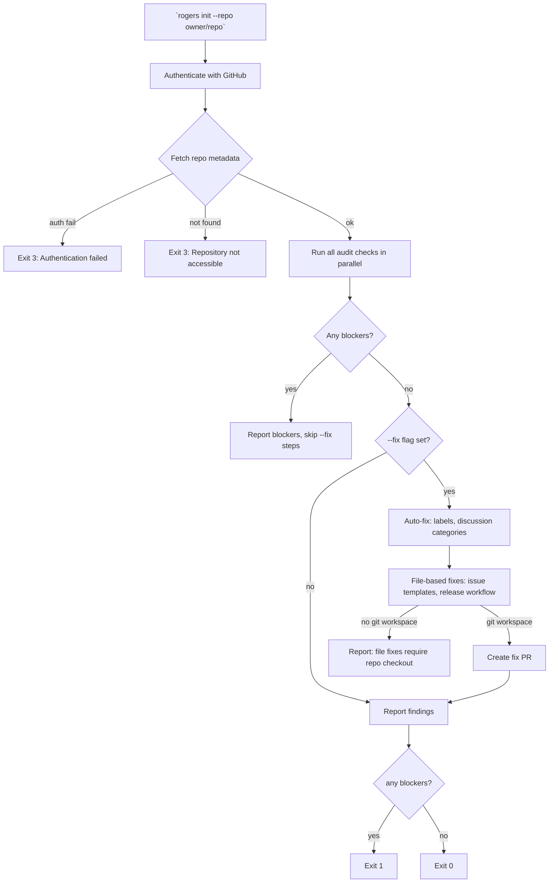

# `rogers init` — Project Readiness Audit

**Status:** Draft
**Plan:** plans/init-plan.md

---

## Summary

`rogers init` audits a GitHub repository for readiness to be managed by Rodgers. It runs a set of checks, reports findings, and can optionally apply fixes for issues it detects. The goal is to ensure the project has the settings, templates, and workflows Rodgers needs before it starts operating.

Run with: `rogers init --repo owner/repo [--fix]`

---

## What Rodgers Needs

Before Rodgers can manage a project responsibly, certain prerequisites must be in place. Rodgers should not operate on a project that has open permissions for random contributors to modify labels, create branches freely, or bypass required reviewers. It also needs issue templates to route incoming reports, GitHub Actions for releases, the correct label set, and if the project has an `AGENTS.md` or similar file, Rodgers must read it and reconcile any contradictions with its own bead methodology before operating.

`rogers init` verifies all of these. It does not modify GitHub repository settings that require admin privileges — it audits and reports, and with `--fix`, it attempts to apply only the changes that are available to the authenticated user.

---

## Audit Checks

Each check has a **severity** ( blocker / warn / info ) and a **fixability** ( auto, manual,na ):

### 1. Issue Templates

**Severity:** blocker
**Fixability:** manual (requires creating/editing files in the repo)
**Check:** Verify `.github/ISSUE_TEMPLATE/` exists with at least one template file.

**Why it matters:** Rodgers routes incoming issues using templates. Without them, all issues arrive unstructured and Rodgers spends triage cycles asking for information that a template would have collected upfront.

**What `rogers init` reports:**
- `blocker` → No `.github/ISSUE_TEMPLATE/` directory found
- `warn` → Directory exists but no `.yml` or `.md` templates found (only blank or minimal templates)
- `info` → Templates found and appear to cover bug reports, feature requests, and questions

Rodgers ships with default templates in ` rogerrs-templates/issue-templates/` that projects can adopt. With `--fix`, Rodgers copies these into the repo and opens a PR if the repo is a git workspace.

### 2. Required Labels

**Severity:** blocker
**Fixability:** auto
**Check:** Verify the repository has all labels Rodgers requires (see architecture-plan.md §Data Model / GitHub Issue States).

**Required labels:**
- `bug`, `feature`, `question` — triage classification
- `needs-information`, `needs-documentation` — routing state
- `ready-for-review`, `will-not-do`, `ready-for-work`, `in-progress` — workflow state

**What `rogers init` reports:**
- `blocker` → Any required label is missing
- `info` → All required labels present with correct colors (optional)

With `--fix`, Rodgers creates any missing labels via the GitHub API using the canonical color scheme from architecture-plan.md.

### 3. Repository Settings

**Severity:** blocker (for the two settings that matter most to Rodgers' operation)
**Fixability:** manual
**Check:** Verify the repository's settings meet Rodgers' operational requirements.

**Blocker-level settings:**
- **Allow fork syncing** — Rodgers does not need forks; this is fine
- **Restrict who can push to main and release branches** — Rodgers needs branch protection so labels and comments are not lost to force-pushes. Check: main and release branches have branch protection rules enabled.

**Warn-level settings:**
- **Allow issue developers to modify labels** — Should be off. If random issue reporters can edit labels, Rodgers' automated label management becomes unreliable.
- **Delete branches on merge** — Recommended on. Prevents stale branches accumulating.
- **Default branch** — Verify it is `main` (Rodgers hardcodes `main` as the primary branch unless `release.active_branches` is configured)

**What `rogers init` reports:**
- `blocker` → Main branch has no branch protection rules
- `warn` → Any of the warn-level settings are in a problematic state
- `info` → All settings look good

Rodgers cannot change repository settings via the API (GitHub does not allow this). It reports findings and provides specific instructions for what a repository admin must change manually. Output includes a direct link to the repository settings page.

### 4. GitHub Actions — Release Workflow

**Severity:** blocker
**Fixability:** manual
**Check:** Verify `.github/workflows/` contains at least one workflow with a release job.

**Why it matters:** Rodgers creates git tags and GitHub Releases. The build artifacts for those releases come from CI. Without a release workflow, Rodgers would create empty releases with no artifacts.

**What `rogers init` looks for:**
- Any `.yml` file under `.github/workflows/` that contains a job with a trigger condition matching: `push` with a tag pattern (`v*`, `*.*.*`), OR a `workflow_dispatch` withrelease inputs
- The workflow should produce build artifacts (binary, wheel, container image, etc.)

**What `rogers init` reports:**
- `blocker` → No release-capable workflow found
- `warn` → Release workflow exists but does not seem to produce artifacts (no `upload-artifact` step detected)
- `info` → Release workflow found and appears to produce artifacts

If no release workflow is found, Rodgers recommends a template workflow in ` rogers-templates/github-actions/release.yml` and explains how to adopt it.

### 5. GitHub Actions — General Workflows

**Severity:** warn
**Fixability:** info
**Check:** Report the set of workflows present and whether CI runs on PRs to main.

**Why it matters:** Rodgers creates branches and files beads but does not run CI directly. If there is no CI on PRs, the project cannot validate Rodgers' own work before it merges.

**What `rogers init` reports:**
- `warn` → No CI workflow found for PRs targeting main
- `info` → CI workflow exists and appears active

### 6. Discussion Categories

**Severity:** warn (for Rodgers' release proposal workflow)
**Fixability:** auto
**Check:** Verify the repository has a GitHub Discussion category Rodgers can use for release proposals.

Rodgers uses GitHub Discussions for release approval workflows (see plans/release-management-plan.md). It creates a `Release Proposals` category if one does not exist.

**What `rogers init` reports:**
- `warn` → No `Release Proposals` category exists
- `info` → Category exists

With `--fix`, Rodgers creates the category via the GitHub API.

### 7. Branch Protection for Release Branches

**Severity:** warn
**Fixability:** manual
**Check:** Verify all branches listed in `config.yaml`'s `release.active_branches` have branch protection rules configured.

**What `rogers init` reports:**
- `warn` → A configured release branch has no branch protection rules
- `info` → All configured release branches are protected

---

### 8. Per-Project Agent Instructions

**Severity:** blocker (for contradictions only)
**Fixability:** info
**Check:** Rodgers looks for agent-instruction files in the repository root and `.github/` directory.

**Files Rodgers looks for (checked in order; first found wins):**
- `.claude/AGENTS.md` — Claude agent instructions
- `.claude/CONTRIBUTING.md` — Claude-specific contributing guide
- `AGENTS.md` — generic agent instructions
- `CONTRIBUTING.md` — contributing guide that may include agent instructions
- `.github/AGENTS.md` — project-level agent instructions

**What `rogers init` does when a file is found:**
1. Rodgers reads and parses the file
2. Rodgers compares the bead/issue format instructions found against Rodgers' own bead methodology (built-in types, `rodgers:type` metadata, plan file references, acceptance criteria format)
3. Rodgers surfaces any **contradictions** as `blocker` findings — contradictions mean Rodgers' default behavior would conflict with the project's stated conventions, and Rodgers cannot safely operate until this is resolved
4. Rodgers surfaces any **gaps** (project describes a workflow Rodgers has no plan for) as `warn` findings

**Contradiction examples:**
- Project's AGENTS.md requires `--type=issue-tracker` but Rodgers uses only built-in bd types → blocker
- Project requires a `priority` field in bead descriptions but Rodgers doesn't populate it by default → blocker
- Project requires all beads to reference a `milestone` tag but Rodgers' `milestone` bead type is optional → warn
- Project requires PR titles to follow a specific format but Rodgers doesn't control PR titles → warn

**What `rogers init` reports:**
- `blocker` → A contradiction exists between agent instructions and Rodgers' bead methodology that would cause incorrect behavior
- `warn` → Agent instructions found with gaps Rodgers cannot cover (no plan for the described workflow)
- `info` → Agent instructions found and fully compatible with Rodgers' methodology

**What `rogers init` does NOT do:**
- Rodgers does not attempt to resolve contradictions automatically
- Rodgers does not modify the project's AGENTS.md file
- Rodgers does not refuse to run if no agent instructions file is found (it falls back to its default methodology)

Rodgers logs the found file path and version (first line / frontmatter) so it is clear which file is being used.

---

### 9. Repo-Level Rodgers Configuration

**Severity:** info
**Fixability:** info
**Check:** Check whether the repository has a `rogers.yaml` file at its root. Rodgers uses this file to override host-level config for this repository's management.

**What `rogers init` reports:**
- `info` → `rogers.yaml` found at commit SHA {sha} — Rodgers will use these settings when operating on this repo
- `info` → No `rogers.yaml` found — Rodgers will use host-level `config.yaml` for all settings

**What `rogers init` does with the file:**
1. Fetch and parse the repo's `rogers.yaml`
2. Merge it with the host's `config.yaml` (repo-level wins for overlapping keys)
3. Validate the merged config against Rodgers' schema (failures are blockers, partial/false schema keys are warnings)
4. Report mismatches: if the repo's `rogers.yaml` specifies settings that contradict Rodgers' expected behavior, surface as blockers

**Example blocker from a bad `rogers.yaml`:**
- Repo config sets `rogation.labels_never_bot_managed` to include a label Rodgers needs to manage for its triage workflow → blocker ("Rodgers cannot operate if `needs-documentation` is marked as never-managed")

**rodgers init should never refuse to run just because no rogers.yaml exists** — the absence of `rogers.yaml` means host config applies, which is a valid deployment mode.

---

## Output Format

`rogers init` outputs a structured report:

```
=== Rodgers Project Readiness Audit ===
Repository: owner/repo
Scanned at: 2026-05-20T14:32:00Z

[BLOCKER] Required labels missing: needs-information, will-not-do
[BLOCKER] Issue templates directory not found
[BLOCKER] No release-capable GitHub Actions workflow found
[WARN   ] Issue developers can modify labels (repository settings)
[WARN   ] Discussion category "Release Proposals" not found
[WARN   ] Main branch has no branch protection rules
[INFO   ] Required labels present: bug, feature, question, ready-for-review, ...
[INFO   ] Release branch protection: release/1.0 OK
[INFO   ] Discussion category "Release Proposals" created

7 checks performed
  3 blockers — Rodgers cannot safely operate
  3 warnings  — review recommended
  2 info     — no action needed

Run 'rogers init --fix' to apply available automated fixes.

To fix repository settings manually:
  https://github.com/owner/repo/settings

Required labels (create these manually or re-run with --fix):
  needs-information (color: #PaleGreen)
  will-not-do (color: #ff4444)
```

### Exit Codes

| Code | Meaning |
|------|---------|
| 0 | All checks passed — project is ready for Rodgers |
| 1 | One or more blocker checks failed |
| 2 | Invalid arguments or configuration |
| 3 | Authentication failed or repository not accessible |

---

## `--fix` Flag Behavior

`--fix` makes Rodgers idempotent — running it multiple times with `--fix` should produce the same result as running it once. Rodgers:

**Applies automatically (via GitHub API):**
- Creates missing required labels
- Creates the `Release Proposals` discussion category

**Does NOT apply (requires repo admin or git access):**
- Issue template files — Rodgers opens a one-time PR with the template files and notes the admin must approve and merge
- Repository settings — Rodgers reports the finding with a direct link to the settings page
- Branch protection rules — same as repository settings
- Release workflow files — same as issue templates

The distinction is: API-level changes get fixed automatically. Filesystem or admin-privilege changes get fixed via a PR floated for human review.

---

## Init Flow (Mermaid)



---

## Implementation Notes

- Rodgers should define a canonical color scheme for each required label in its codebase (see `src/labels.rs` or equivalent), so `init --fix` can apply the correct colors consistently.
- The release workflow check should look for common artifact patterns: `upload-artifact`, `aws s3 cp`, `gh release upload`, container `docker push`. Regex search over workflow YAML is sufficient.
- `init` should be safe to re-run. All API calls it makes should be idempotent (create-if-missing semantics for labels and discussion categories).

---

## Acceptance Criteria

- [ ] AC-1: `rogers init --repo owner/repo` exits 0 when all blocker checks pass
- [ ] AC-2: `rogers init --repo owner/repo` exits 1 when any blocker check fails, listing all blockers
- [ ] AC-3: `rogers init --repo owner/repo --fix` creates missing required labels via GitHub API
- [ ] AC-4: `rogers init --repo owner/repo --fix` creates missing discussion categories via GitHub API
- [ ] AC-5: `rogers init` reports blocks for missing issue templates and missing release workflow with specific instructions
- [ ] AC-6: `rogers init` produces a structured report with severity, description, and fixability for each check
- [ ] AC-7: `rogers init` is safe to re-run (idempotent: same input = same result)