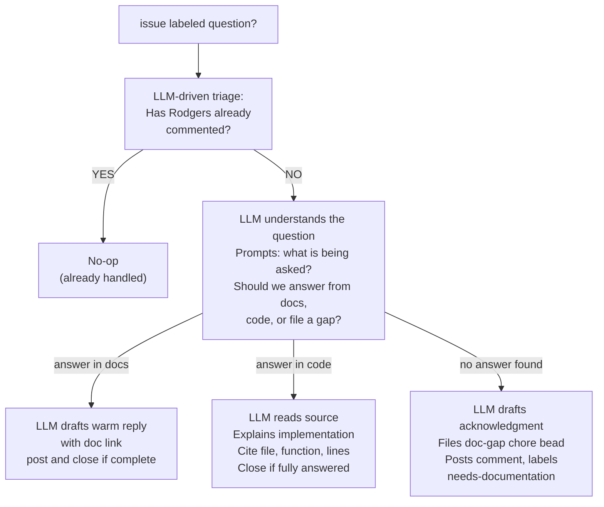

# Question Routing Plan

**Status:** Draft  
**Plan:** plans/question-routing-plan.md  
**Depends on:** plans/architecture-plan.md  

---

## Summary

When a community member files an issue labeled `question`, Rodgers determines whether the answer already exists in the project's documentation. If it does, Rodgers posts a comment with a link. If it does not, Rodgers treats it as a documentation gap and the workflow in this document applies.

---

## Workflow

### Step 1: Classify as Question

When the Triage Engine encounters an issue labeled `question`, it passes it to the Question Router. If the issue has no existing comments from Rodgers, proceed to Step 2.

### Step 2: Search Documentation and Code

Rodgers searches `docs/` for content relevant to the question. Search is keyword-based over the full text of documentation files. The goal is recall: better to find a partial match than miss the right doc.

**Additionally**, when a question asks about code-level or implementation-level details, Rodgers searches the project source code directly. This covers questions like "how does X work under the hood?", "which function handles Y?", "walk me through the flow of Z", or "what data structure is used for W?". Rodgers should answer these from the code rather than treating them as doc gaps.

**Search scope for docs:**
- `docs/**/*.md` — all user-facing documentation

**Search scope for code (when applicable):**
- `src/**/*` — source files
- `lib/**/*` — library files
- Globally: any `*.rs`, `*.py`, `*.js`, `*.ts`, `*.go` file in the project

**How Rodgers knows to search the code:**
- Keywords in the issue title or body: "how does", "what function", "which module", "internals", "implementation", "source code", "can you walk me through", "flow of", "under the hood"
- Explicit request to see or understand the code behavior
- A question about a specific function, class, or module by name

**Search targets:**
- Filenames
- Function and struct names
- Comments and docstrings
- Code logic comments

### Step 3a: Documentation Found

Rodgers posts a comment on the issue:

```
Hi @[requestor], thanks for the question!

The answer to your question is covered in [docs/filename.md §section-title]().

[One-sentence summary of the relevant content, extracted from the doc.]

If this doesn't fully answer your question, please let us know and we will follow up.
```

Rodgers then closes the issue or leaves it open based on the answer quality — if the linked doc fully answers, close the issue; if it's partial, leave it open and wait for follow-up.

### Step 3a-ii: Code Answer Found

When Rodgers finds the answer by reading source code (not documentation):

```
Hi @[requestor], thanks for this question! I took a look at the source code to find the answer.

[Plain-language explanation of how the code works, targeted at the specific question asked.
Cite the relevant file and function name, line numbers if helpful.
If the code is complex, walk through the logic step by step.]

Relevant source: [file path], [function/struct name]

If you'd like to dig further, the full implementation is at [file:line–line].
```

- **Close the issue** if the explanation fully answers the question
- **Leave open** if the requestor may have follow-up questions
- **Do NOT file a doc-gap bead** — the code is the canonical answer; no documentation gap exists

### Step 3b: No Answer Found

**This step applies only when neither documentation nor a code review yields an answer.** If Rodgers found relevant code but the question goes beyond what the code reveals, or the question asks about design intent rather than mechanics, treat as a documentation gap.

If Rodgers cannot answer the question from docs or code, this is a documentation gap. Rodgers files a `chore` bead (`rodgers:type=docs`) to track the gap and proceeds:

1. **File a `chore` bead** (metadata: `rodgers:type=docs`) with:
   - Type: `chore`
   - Tag: `rodgers:type=docs`
   - Title: `Answer question: [one-line restatement of the question]`
   - Description: the full question text from the issue, the full issue body, and any relevant context
   - Acceptance: a new section in the relevant doc that answers the question; the section must be linked from the issue when filed
   - `discovered-from` link to the originating issue

2. **Post a comment** on the GitHub issue:

```
Hi @[requestor], thanks for the question! We do not currently have documentation that answers this. We have opened a task to add an answer to our documentation — it will be linked here when complete.
```

3. **Label the issue** with `needs-documentation`. Remove `question` label.

### Step 4: Update Docs (Sideband)

The human or agent working the `chore` bead (metadata: `rodgers:type=docs`) updates the relevant documentation file with a section that answers the question. When the doc section is written and checked in, the implementer posts the link as a comment on the GitHub issue and closes the issue.

### Step 5: Sync Bead to GitHub Issue

When the `chore` bead (metadata: `rodgers:type=docs`) is closed, Rodgers verifies that the GitHub issue has a comment linking to the new documentation. If the comment is missing, Rodgers posts the link.

---

## Question Router Decision Tree



**LLM prompt for question routing (Step 1→2):**
- Provide: question title, body, all prior comments, existing labels
- Provide: project domain context from AGENTS.md
- Ask: "Is this a genuine question that can be answered from documentation or source code? Or is this actually a bug report or feature request in disguise? What specific information would be needed to answer this question?"
- Ask: "Should Rodgers search the codebase for implementation details, or is the answer in user-facing documentation?"

---

## Edge Cases

**Question is not a question.** If Rodgers determines the issue is actually a bug report or feature request in disguise, it re-labels it accordingly and hands it to the Feature/Bug workflow (plans/feature-bug-plan.md) instead.

**Question is too vague to answer.** Rodgers posts a comment asking for clarification before the doc search. Once clarification is received, it restarts from Step 2.

**Multiple questions in one issue.** Treat as multiple questions. Answer each question in a separate comment. For those questions which require beads, file separate `chore` beads (`rodgers:type=docs`) for each.

**Doc search returns false positives.** Rodgers presents the most relevant doc link. If the requestor says the linked doc doesn't answer their question, treat as Step 3b — file a `chore` bead (`rodgers:type=docs`).

**Requestor adds more context after Rodgers responds.** Rodgers processes the new comment as a new triage event — restarts from Step 1.

**Question requires tracing multiple files.** When a question about code internals spans multiple files or modules, Rodgers finds the entry point and explains the flow, linking to all relevant files. If the full picture requires more depth than can fit in one comment, Rodgers posts a partial explanation and offers to continue.

---

## Acceptance Criteria

- [ ] CRIT-1: When a `question` issue exists and docs exist that answer it, Rodgers posts a comment within one triage run with the correct doc link
- [ ] CRIT-2: When a `question` issue exists and no docs answer it, Rodgers searches the source code if the question is about implementation details before filing a doc-gap bead
- [ ] CRIT-3: When Rodgers finds an answer in the source code, it posts a plain-language explanation citing the relevant file, function, and line numbers, then closes the issue if fully answered
- [ ] CRIT-4: When a `chore` bead (`rodgers:type=docs`) is closed, Rodgers verifies the GitHub issue has a documentation link and closes or updates the issue accordingly
- [ ] CRIT-5: Rodgers never closes a question issue without either answering it or filing a `chore` bead (`rodgers:type=docs`)
- [ ] CRIT-6: Rodgers never routes a non-question issue through this workflow
