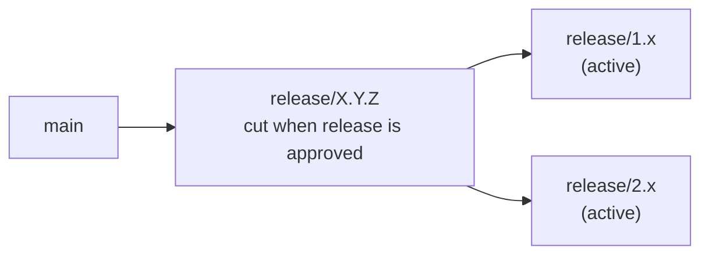
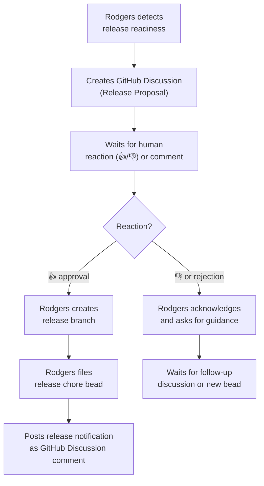

# Release Management Plan

**Status:** Draft  
**Plan:** plans/release-management-plan.md  
**Depends on:** plans/architecture-plan.md  

---

## Summary

Rodgers monitors the release branches and cuts new releases when criteria are met. It does not cut releases autonomously — it proposes them to a human via a GitHub Discussion and waits for approval before executing the release.

---

## Branch Strategy

Rodgers maintains a standard release branch strategy:



- **`main`** — All development flows here. Possibly a `canary` or `nightly` integration point depending on project maturity.
- **`release/X.Y.Z`** — Created from `main` at approval time. Immutable after creation.
- **Prior releases** — If the project maintains multiple active release lines (e.g., `release/1.x`, `release/2.x`), each is independently maintained by Rodgers via backport beads (see plans/backport-plan.md).

---

## Release Readiness

Rodgers monitors `main` (and each release branch) on every triage run for the following criteria:

### Criteria to Propose a Release (from main)

All must be true:
1. The last commit to `main` has passed all CI checks
2. There are no open blocker issues labeled with the release milestone (or no milestone is set)
3. A human has marked issues for this release with a milestone
4. The milestone has no open `blocker` labeled issues

### Criteria to Propose a Release (from a release branch)

All must be true:
1. A hotfix or planned change has been merged to the release branch since the last release
2. CI is green on the release branch
3. A human has flagged the release branch as needing a release via a bead status change or GitHub Discussion

---

## Release Proposal

When all release readiness criteria are met, Rodgers creates a GitHub Discussion in the category specified by `config.github.approval_discussion_category`.

The discussion is titled: `[Release Proposal] X.Y.Z`.

The body contains:

```
## Release {version}

**Proposed by:** Rodgers  
**Source:** {main | release/X.Y.Z}  
**Commits since last release:** {N} commits

### Issues in this release

{list of issues in the milestone, linked}

### Breaking Changes

{list or "None"}

### Migration Notes (if applicable)

{relevant upgrade guidance}

### Vote

React with 👍 to approve, 👎 to reject.  
Release will be cut within 48 hours of approval unless vetoed.
```

---

## Release Approval Flow



### Approval Criteria

- **👍 from any human with write access or above** → proceed with release
- **👎 from any human with write access or above** → halt and ask for guidance
- **No response within 48 hours** → ping the discussion once
- **No response within 7 days** → close the proposal as stale, file a bead to revisit

---

## Release Execution

When approved, Rodgers:

1. Creates a branch `release/X.Y.Z` from the source branch (main or release branch)
2. Files a `chore` bead (`rodgers:type=release`) describing the build, test, tag, and GitHub Release creation work
3. Creates the git tag `X.Y.Z` and the GitHub Release (APIs, no artifact generation)
4. Posts a comment on the original proposal Discussion: "Release {X.Y.Z} branch created, tag created, GitHub Release created. Artifact build via CI. [Link to release]"
5. Closes the proposal Discussion

Rodgers does not run the CI build that produces release artifacts. It creates the tag and GitHub Release entry. CI generates the artifacts.

---

## Cut a New Release from Main (Summary)

1. CI green on main
2. Milestone has no open blocker issues
3. Rodgers creates a Release Proposal Discussion
4. Human approves with 👍
5. Rodgers creates release branch + files release bead
6. Rodgers notifies via Discussion
7. Actors outside Rodgers do: build release artifacts (CI), run final verification, create the git tag, create the GitHub Release (Rodgers can do the git tag and GitHub Release APIs, but the artifact build is CI)

---

## Configuration

```yaml
github:
  owner: OWNER
  repo: REPO
  token: ROGERS_GITHUB_TOKEN  # via env var

release:
  approval_discussion_category: "Announcements"  # GitHub Discussion category for proposals
  voting_window_days: 2  # Days to wait before auto-ping
  stale_threshold_days: 7  # Days before closing stale proposal
```

---

## Edge Cases

**No milestone set.** If issues are being worked but no milestone exists, Rodgers does not propose a release. It files a bead: "Consider creating a milestone for the current work."

**Human wants to bundle multiple milestones into one release.** Human leaves a comment on the Discussion with the adjusted scope, and Rodgers incorporates the additional issues. This is a manual decision — Rodgers does not automate cross-milestone bundling.

**Release branch already exists for the version.** Rodgers does not create a duplicate. It posts a comment noting the collision and asks for guidance.

**CI is red on a proposed release branch.** Rodgers posts a comment on the release Discussion noting the failure and halts. Files a bead for the CI issue.

**Hotfix urgency.** If a critical bug requires an immediate hotfix and a human cannot approve in time, a human with write access posts an approval comment ("Approve for immediate release") and Rodgers proceeds without waiting for a 👍 reaction.

---

## Acceptance Criteria

- [ ] CRIT-1: When all readiness criteria are met and CI is green, Rodgers creates a Release Proposal Discussion within one triage run
- [ ] CRIT-2: Rodgers waits for human approval before cutting any release (releases never cut autonomously)
- [ ] CRIT-3: A 👍 reaction (or explicit approval comment) from a human triggers release execution within one triage run
- [ ] CRIT-4: Rodgers creates the release branch, GitHub tag, GitHub Release, and closes the proposal in one atomic sequence
- [ ] CRIT-5: A 👎 reaction halts the release and prompts Rodgers to await further guidance
- [ ] CRIT-6: Rodgers posts a notification on the proposal Discussion after the release is cut
- [ ] CRIT-7: Stale proposals (no response within 7 days) are flagged with a follow-up bead, not silently abandoned