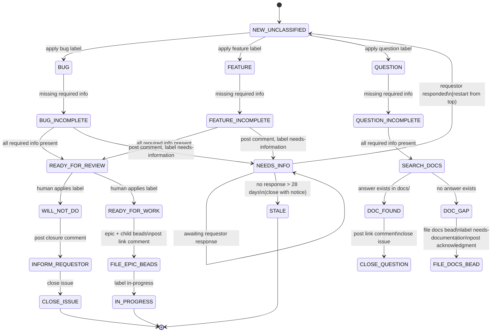

# Triage Workflow Plan

**Status:** Draft  
**Plan:** plans/triage-workflow-plan.md  
**Depends on:** plans/architecture-plan.md, plans/feature-bug-plan.md, plans/question-routing-plan.md, plans/release-management-plan.md, plans/backport-plan.md  

---

## Summary

This plan defines the triage state machine: how Rodgers processes every new and updated GitHub issue, classifies it, and advances it through the workflow. It is the central document that coordinates the Feature, Bug, Question, and Release workflows defined in their respective plans.

---

## Triage Loop

On every schedule tick, Rodgers processes all issues that have changed since the last run. It reads the full issue state (labels, comments, body, assignee) and applies the state machine.

The state machine is applied **per issue per run**. Rodgers never assumes an issue is in a particular state from a previous run — it always re-evaluates.

---

## Top-Level Classification

Every issue starts in one of these top-level categories:

| Label | Type | Workflow |
|-------|------|----------|
| `bug` | Bug report | plans/feature-bug-plan.md |
| `feature` | Feature request | plans/feature-bug-plan.md |
| `question` | Question | plans/question-routing-plan.md |
| (no relevant label) | Unclassified | Step 1 of this plan |

**How Rodgers classifies:** Rodgers sends the issue (title + body + author context) to the LLM with a structured prompt asking it to classify intent (Bug, Feature, Question), assess information completeness, and return a structured decision. Rodgers validates the LLM response with the Structured Output Validator before acting on it.

**Prompt strategy for classification:**
- Provide: issue metadata (title, body, author, existing labels, prior comments)
- Provide: brief domain context from AGENTS.md or rogers.yaml if found
- Ask: "What type is this: Bug, Feature, Question, or Other? What information is present and what is missing? Should Rodgers act on this, ignore it, or escalate?"

**Default behavior:** If the LLM cannot determine the type with confidence, Rodgers defaults to `question` — people filing issues often have questions they don't know how to phrase.

**Respects existing human labels:** If another label is already present from a previous triage run, Rodgers uses the existing classification and does not override it. Rodgers only applies the initial label on first encounter.

---

## State Machine

---

## State Descriptions

### NEW / UNCLASSIFIED

**Entry:** Issue exists with no Rodgers-applied label from a prior triage run.

**Action:** Rodgers reads the issue body and author context. During this read, Rodgers calls `get_issue` (tool) and checks `author.type`. If `author.type == "Bot"`, Rodgers applies all labels from `triage.bot_labels` to the issue, then skips triage for this issue entirely for this run. Otherwise, Rodgers applies the appropriate initial label (`bug`, `feature`, or `question`), applies any `bot_labels` detection (see triage configuration). Moves to `INCOMPLETE` or proceeds directly to the appropriate workflow.

### INCOMPLETE (bug / feature)

**Entry:** Issue is labeled `bug` or `feature` but is missing required information for its type.

**Action:** Rodgers prompts the LLM to read the issue and determine exactly what information is missing (reproduction steps for a bug, acceptance criteria for a feature, scope for a large feature). The LLM drafts a specific, warm comment requesting exactly what is needed. Rodgers validates the comment with the Structured Output Validator before posting. Rodgers applies `needs-information` label.

**Exit:** When the requestor responds, the next triage run processes the new comment as a state machine restart from `NEW`.

### INCOMPLETE (question)

**Entry:** Issue is labeled `question` but Rodgers needs clarification to understand what is being asked.

**Action:** Rodgers prompts the LLM to read the issue and draft a question asking for clarification. Rodgers validates and posts the comment. Applies `needs-information` label.

**Exit:** Same as bug/feature incomplete.

### NEEDS-INFORMATION

**Stub state** — the `needs-information` label and the awaiting state are represented by the issue being in this labeled state without a Rodgers comment having been posted.

When Rodgers sees `needs-information` applied, it checks:
- Has the requestor responded since the label was applied?
  - Yes → remove label, restart from top
  - No → has it been more than 14 days? If yes, post a gentle ping comment. If still no response after 4 more runs (28 days total), transition to `STALE`.

### STALE

**Entry:** No response for 28 days after `needs-information` was applied.

**Action:** Rodgers prompts the LLM to draft a warm, non-accusatory closure notice. Rodgers validates and posts the comment. Closes the issue.

### SEARCH_DOCS

**Entry:** Issue labeled `question` has sufficient information to identify what is being asked.

**Action:** Rodgers searches `docs/` for an answer. See plans/question-routing-plan.md for search scope and decision logic. Rodgers also may ask the LLM to determine if a code search is warranted (questions about implementation details).

### DOC_FOUND

**Entry:** Rodgers found documentation that answers the question.

**Action:** Rodgers prompts the LLM to read the docs link and draft a comment that is warm, links to the relevant doc, and summarizes the answer in one or two sentences. Rodgers validates and posts the comment. Closes the issue if the answer fully resolves the question; leaves open if follow-up is expected. See plans/question-routing-plan.md §Step 3a.

### DOC_GAP

**Entry:** Rodgers found no documentation answering the question.

**Action:** Rodgers files a `chore` bead (`rodgers:type=docs`) and applies `needs-documentation` label. Posts acknowledgment comment on the issue. See plans/question-routing-plan.md §Step 3b.

### READY-FOR-REVIEW

**Entry:** Rodgers has applied `ready-for-review` after determining the issue is complete.

**Action:** Rodgers waits. It does not move the issue without a human action.

**Exit events:**
- Human applies `will-not-do` → transition to `WILL-NOT-DO`
- Human applies `ready-for-work` → transition to `READY-FOR-WORK`

### WILL-NOT-DO

**Entry:** Human has applied `will-not-do`.

**Action:** Rodgers prompts the LLM to draft a warm, empathetic closure comment referencing the issue content. Optional: the human reviewer's brief reason (Rodgers extracts this from comments on the `will-not-do` label application). Rodgers validates and posts the comment. Rodgers closes the issue. No further action.

### READY-FOR-WORK

**Entry:** Human has applied `ready-for-work`.

**Action:** Rodgers prompts the LLM to assess whether the issue is epic-scale (see Epic Bead Breakdown Procedure above). If yes, Rodgers follows the breakdown procedure: files the epic bead + child beads (all `deferred`), posts a breakdown comment linking to each bead, and awaits a human signal before setting children to `open`. If no (standard bug/feature), Rodgers files the epic bead and proceeds to `IN_PROGRESS` with the epic as a single- bead work item following plans/feature-bug-plan.md.

### IN_PROGRESS

**Entry:** Epic bead created, work is underway.

**Exit (passive, next poll):** On every triage run, Rodgers evaluates all issues in `IN_PROGRESS` — issues labeled `in-progress` or that have an open epic bead with child beads. If Rodgers detects that all child beads are closed **and** the GitHub issue is in a closed state, Rodgers closes the epic bead and the loop terminates for that issue.

Rodgers does not force-close the GitHub issue proactively. It relies on the human to close the issue or on a configured automation (e.g., GitHub Actions workflow that closes issues when all linked PRs merge). Rodgers detects the closed state on the next triage run.

**Stalled IN_PROGRESS recovery:** If Rodgers detects an `IN_PROGRESS` issue whose child beads are all closed but the GitHub issue is still open, it posts a comment on the issue asking the human to close it or confirm the work is done. Rodgers does not close the issue on the human's behalf. This is a one-time alert per stalled state — Rodgers does not repeat the ping unless new activity restarts the loop.

---

## Compound Issues

**Mixed issue (bug + question + feature in one):** Rodgers splits the issue. If possible, it files a separate issue for each distinct concern and closes the original with a comment explaining the split. Each new issue is triaged independently. This prevents a single `will-not-do` on a feature request from accidentally closing a legitimate bug report.

**Epic-scale issue:** Rodgers uses LLM judgment to detect epic-scale work when `ready-for-work` is applied. Two primary indicators:
- The work spans multiple areas of the project (e.g., "UI and API," "backend and docs," "redesign auth system")
- The description contains sequential or continuation logic ("Do this, and then do this, and then...") that naturally maps to multiple sub-tasks

**Epic Bead Breakdown Procedure:**

When Rodgers transitions an issue to `READY-FOR-WORK`, it prompts the LLM to analyze whether the work is epic-scale. If yes, Rodgers applies a structured breakdown:

1. **Detect.** LLM reads the issue title, body, all comments, and relevant codebase context (search_code against the affected components) to identify distinct work areas.

2. **File epic bead.** Rodgers files one `epic`-type bead. The title is the GitHub issue title. The description is a LLM-summarized "What and Why" from the issue. Status: `deferred`. Linked to the GitHub issue.

3. **File child beads.** Rodgers prompts the LLM to enumerate the distinct sub-work items. Each child bead:
   - Type: whatever makes sense (`feature`, `chore`, `bug` — Rodgers has discretion)
   - Title: self-contained description of the sub-work item
   - Description: LLM-summarized scope, referencing the relevant parts of the epic issue
   - Status: `deferred` (all children start deferred)
   - Parent: the epic bead ID
   - All child beads are filed before any are marked `open`

4. **Post breakdown comment.** Rodgers posts a comment on the GitHub issue:
   - Links to the epic bead and each child bead
   - States that all child beads are in `deferred` status pending human review
   - Invites the human to adjust types or set children to `open`

5. **Human review gate.** Upon human action — any human modification to a child bead (changing its title, type, description, status, or assignee), or any human comment on the issue or any bead — Rodgers treats that as the human accepting the breakdown. Rodgers sets the reviewed children to `open` as a batch on that signal.

6. **Orphan detection.** On each triage run, Rodgers checks for issues labeled `ready-for-work` that have no linked epic bead. If found (run fail state), Rodgers files the epic and child beads following the procedure above and posts the breakdown comment.

**What Rodgers does NOT do:**
- Rodgers does not set any child bead to `open` without a human signal
- Rodgers does not attempt to estimate implementation complexity or assign priority during the breakdown
- Rodgers does not file an epic bead if the issue is not epic-scale

---

## Edge Cases

**Issue modified after passing READY-FOR-REVIEW.** If the requestor substantially updates an issue after Rodgers has marked it `ready-for-review`, Rodgers removes the `ready-for-review` label, re-evaluates completeness, and restarts from `INCOMPLETE` if needed.

"Substantial" is a judgment call by Rodgers' LLM. Factors that indicate a substantial update include but are not limited to: new information that changes what the issue is asking for, revised scope that adds or removes significant functionality, or changed acceptance criteria that would require re-evaluating whether the issue is ready for work. A minor typo fix, reformatting, or a comment from the requestor that adds no new actionable information does not constitute a substantial update.

**Human marks ready-for-work but Rodgers hasn't filed the epic yet.** This cannot happen in normal flow — Rodgers files the epic in the same run that it detects `ready-for-work`. However, if the run fails mid-execution, the next run detects the orphan state and files the epic.

**Human applies both labels or contradictory state.** Rodgers processes in priority order: `will-not-do` > `ready-for-work`. If both are somehow applied simultaneously, Rodgers defaults to `will-not-do`.

**Unknown label.** Rodgers ignores unrecognized labels and attempts to process the issue based on the GitHub issue body content only.

---

## Cross-References

- Bug/Feature workflow: plans/feature-bug-plan.md
- Question workflow: plans/question-routing-plan.md
- Release management: plans/release-management-plan.md
- Backport: plans/backport-plan.md  
- Architecture: plans/architecture-plan.md

---

## Acceptance Criteria

- [ ] CRIT-1: Every new unclassified issue label (`bug`, `feature`, or `question`) from the validated LLM response
- [ ] CRIT-2: An issue in `INCOMPLETE` state is never moved to `READY-FOR-REVIEW` until the LLM confirms completeness based on issue type requirements
- [ ] CRIT-3: Rodgers transitions `READY-FOR-REVIEW` → `WILL-NOT-DO` or `READY-FOR-WORK` only on human action (human applies the label)
- [ ] CRIT-4: When transitioning to `WILL-NOT-DO`, Rodgers drafts and posts an LLM-composed closure comment, then closes the issue within one triage run
- [ ] CRIT-5: When transitioning to `READY-FOR-WORK`, Rodgers drafts a bead description with the LLM, files the epic+child beads within one triage run, and posts a comment linking to the epic
- [ ] CRIT-6: An issue with `needs-information` that has had no response for more than 14 days receives an LLM-drafted ping. After 28 days total with no response, the issue is closed with an LLM-drafted stale notice.
- [ ] CRIT-7: Rodgers never makes a human gate decision (`will-not-do`, `ready-for-work`) on its own — it only observes and acts on the human's label applied to the GitHub issue
- [ ] CRIT-8: All public comments Rodgers posts are LLM-drafted, validated by the Structured Output Validator, and reviewed against Rodger's warmth principle before being sent to GitHub
- [ ] CRIT-9: On detecting epic-scale work at `READY-FOR-WORK`, Rodgers files the epic bead and all child beads before any bead is set to `open`; all child beads start `deferred`
- [ ] CRIT-10: Rodgers does not set any child bead to `open` until it detects a human signal (human comment or any human-initiated bead modification); on that signal, Rodgers sets all non-closed child beads to `open` as a batch
- [ ] CRIT-11: When all child beads of an epic are closed and the GitHub issue is in a closed state, Rodgers closes the epic bead within one triage run of detecting that condition; stalled issues (all children closed, issue still open) receive a one-time alert comment asking the human to close the issue
- [ ] CRIT-12: When Rodgers encounters an issue where `author.type == "Bot"` (detected via `get_issue`), it applies all `triage.bot_labels` labels to the issue and skips triage for that issue for the current run